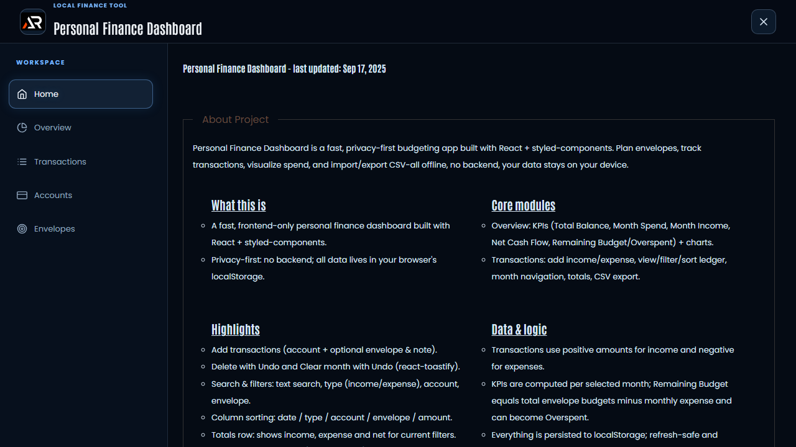

# Personal Finance Dashboard

A responsive frontend-only finance dashboard built with React. Track transactions, review monthly KPIs, manage accounts and envelopes, view charts, and export CSV data while keeping state in browser storage.



## Features

- Monthly overview with balance, income, expense, net cash flow, and budget KPIs
- Income and expense charts with month navigation
- Transaction search, filters, sorting, totals, delete undo, and CSV export
- Account and envelope management with local persistence
- Responsive fixed header, independent navigation panel, active-link scrolling, and icon-only footer links

## Tech stack

React, Vite, React Router, styled-components, Material UI, Recharts, Zustand, Dexie, and LocalStorage.

## Run locally

```bash
npm install
npm run dev
```

Run `npm run lint` and `npm run build` before publishing. Deploy with `npm run deploy`.

Live URL: [a2rp.github.io/personal-finance-dashboard](https://a2rp.github.io/personal-finance-dashboard/)

All data stays in the browser. This project has no backend.

## Links

- Portfolio: [https://www.ashishranjan.net/](https://www.ashishranjan.net/)
- GitHub: [https://github.com/a2rp](https://github.com/a2rp)
- CodePen: [https://codepen.io/ash1198](https://codepen.io/ash1198)
- LinkedIn: [https://www.linkedin.com/in/aashishranjan](https://www.linkedin.com/in/aashishranjan)
- Facebook: [https://www.facebook.com/theash.ashish/](https://www.facebook.com/theash.ashish/)
- YouTube: [https://www.youtube.com/@ashishranjan-ashz?sub_confirmation=1](https://www.youtube.com/@ashishranjan-ashz?sub_confirmation=1)
- Email: [ash.ranjan09@gmail.com](mailto:ash.ranjan09@gmail.com)

## Support

- Support: [https://a2rp-donation-page.netlify.app/](https://a2rp-donation-page.netlify.app/)
- Buy Me a Coffee: [https://buymeacoffee.com/a2rp](https://buymeacoffee.com/a2rp)
- Patreon: [https://patreon.com/a2rp](https://patreon.com/a2rp)
